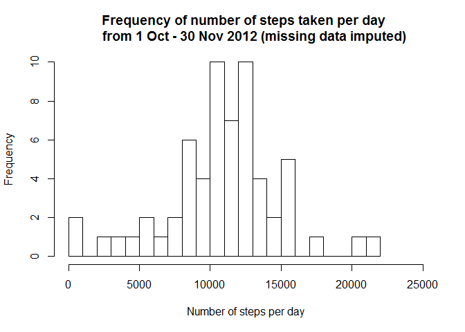

# Reproducible Research: Peer Assessment 1


### 1. Code for reading in the dataset and/or processing the data
Unzip file, read and convert date variable into a date format.

```r
unzip("activity.zip")
activity <- read.csv("activity.csv")
activity$date <- as.Date(activity$date)
str(activity)
```

```
## 'data.frame':	17568 obs. of  3 variables:
##  $ steps   : int  NA NA NA NA NA NA NA NA NA NA ...
##  $ date    : Date, format: "2012-10-01" "2012-10-01" ...
##  $ interval: int  0 5 10 15 20 25 30 35 40 45 ...
```

```r
head(activity)
```

```
##   steps       date interval
## 1    NA 2012-10-01        0
## 2    NA 2012-10-01        5
## 3    NA 2012-10-01       10
## 4    NA 2012-10-01       15
## 5    NA 2012-10-01       20
## 6    NA 2012-10-01       25
```

### 2. Histogram of the total number of steps taken each day
Use ddply from the plyr package to create a dataframe holding the number of steps taken per day.

```r
library(plyr)
histodata <- ddply(activity,.(date),summarise,stepspd=sum(steps))
```

Produce the histogram

```r
hist(histodata$stepspd, ylim=range(0,10),breaks=25,xlim=range(0,25000),
     xlab="Number of steps per day",
     main="Frequency of number of steps taken per day from 1 Oct - 30 Nov 2012")
```

<!-- -->


### 3. Mean and median number of steps taken each day

```r
meand <- mean(histodata$stepspd, na.rm = TRUE)
mediand <- median(histodata$stepspd, na.rm = TRUE)
```

The mean number of steps taken per day is 10766 and the median number of steps taken each day is 10765.


### 4. Time series plot of the average number of steps taken
Calculate the average steps by interval

```r
intervaldata <- ddply(activity,.(interval),summarise,
                      stepspi=mean(steps, na.rm = TRUE))
```

Plot average steps by interval

```r
plot(intervaldata$interval, intervaldata$stepspi, type="l",
     main="Average number of steps taken in each time interval in Oct-Nov 2012",
     xlab="5 minute time interval",
     ylab="Average number of steps in time interval",
     xlim=range(0,2500))
```

<!-- -->


### 5. The 5-minute interval that, on average, contains the maximum number of steps

```r
row <- which.max(intervaldata$stepspi)
x <- intervaldata[row,1]
str(intervaldata)
```

```
## 'data.frame':	288 obs. of  2 variables:
##  $ interval: int  0 5 10 15 20 25 30 35 40 45 ...
##  $ stepspi : num  1.717 0.3396 0.1321 0.1509 0.0755 ...
```

The 5 minute interval labeled as 835 (i.e. 835 - 839 minutes) has the highest average number of steps taken in the October to November time period.


### 6. Code to describe and show a strategy for imputing missing data

First, look for patterns in the missing data.

1. check which days are missing data, and how much data is missing

```r
#create variables storing number of days from first data point
startdate <- activity[1,2]
activity$numdays <- difftime(activity$date,startdate,units="days")

naperday <- table(activity$steps, activity$numdays,useNA="always")
naperday <- tail(naperday,1)

barplot(naperday,
        ylim=range(0,300), las=2, cex.axis = 0.5, cex.names=0.5,
        xlab = "Day", ylab="Number of missing datapoints",
        main="Missing data points by day")
```

<!-- -->

Data are missing for entire days at a time, i.e. 288 missing data points.
There does not appear to be a pattern over the 60 days of when there a days missing data.


Check whether there are certain days of the week that have missing data

```r
activity$days <- weekdays(activity$date)
nadayofweek <- table(activity$steps, activity$days,useNA="always")
nadayofweek <- tail(nadayofweek,1)
nadayofweek
```

```
##       
##        Friday Monday Saturday Sunday Thursday Tuesday Wednesday <NA>
##   <NA>    576    576      288    288      288       0       288    0
```
There does not appear to be a strong pattern for which days of the week are missing data.

Next, look for patterns in the data that will be used to impute.
Calculate the average steps by interval and day.

```r
intervaldataday <- ddply(activity,.(interval, days),summarise,
                      stepspid=mean(steps, na.rm = TRUE))
```

Plot average steps by interval

```r
library(ggplot2)
p <- qplot(interval,stepspid,data=intervaldataday, 
        geom="line",
        xlim=range(0,2500),
        ylab="Average number of steps in time interval",
        xlab="5 minute time interval and day of week",
        main="Average number of steps taken in each time interval by day in Oct-Nov 2012")
p <- p + facet_wrap(~days, ncol=3)
p
```

<!-- -->

It appears that the pattern of activity changes for each day of the week, as well as by 5 minute interval.

Therefore, we should impute missing data using the mean number of steps by interval and day.


```r
# Extract complete data
missing <- activity[is.na(activity$steps),]
complete <- activity[!is.na(activity$steps),]

missing <- merge(missing, intervaldataday, by=c("days", "interval"))
missing$steps <- missing$stepspid
missing <-subset(missing, select= -c(stepspid))

imputed <- rbind(missing,complete)
imputed <- subset(imputed, select=-c(numdays, days))
imputed <- imputed[order(imputed$date,imputed$interval),]
imputed$id <- seq.int(nrow(imputed))
rownames(imputed) <- imputed$id
imputed <- subset(imputed,select=-c(id))
imputed <- imputed[,c("steps", "date", "interval")]
str(imputed)
```

```
## 'data.frame':	17568 obs. of  3 variables:
##  $ steps   : num  1.43 0 0 0 0 ...
##  $ date    : Date, format: "2012-10-01" "2012-10-01" ...
##  $ interval: int  0 5 10 15 20 25 30 35 40 45 ...
```

The complete data looks like this:

```r
head(imputed)
```

```
##      steps       date interval
## 1 1.428571 2012-10-01        0
## 2 0.000000 2012-10-01        5
## 3 0.000000 2012-10-01       10
## 4 0.000000 2012-10-01       15
## 5 0.000000 2012-10-01       20
## 6 5.000000 2012-10-01       25
```

Compared to the original dataset, which looks like this:

```r
head(activity)
```

```
##   steps       date interval numdays   days
## 1    NA 2012-10-01        0  0 days Monday
## 2    NA 2012-10-01        5  0 days Monday
## 3    NA 2012-10-01       10  0 days Monday
## 4    NA 2012-10-01       15  0 days Monday
## 5    NA 2012-10-01       20  0 days Monday
## 6    NA 2012-10-01       25  0 days Monday
```

###7 Histogram of the total number of steps taken each day after missing values are imputed

Use ddply from the plyr package to create a dataframe holding the number of steps taken per day, and produce histogram

```r
histodata2 <- ddply(imputed,.(date),summarise,stepspd=sum(steps))

hist(histodata2$stepspd, ylim=range(0,10),breaks=25,xlim=range(0,25000),
     xlab="Number of steps per day",
     main="Frequency of number of steps taken per day 
     from 1 Oct - 30 Nov 2012 (missing data imputed)")
```

<!-- -->

For comparison, this histogram (left) is displayed next to the previous histogram (right), and it can be seen that they look very similar, with some changes in frequency around the centre of the graph.


```r
par(mfrow=c(1,2))
hist(histodata2$stepspd, ylim=range(0,10),breaks=25,xlim=range(0,25000),
     xlab="Number of steps per day",
     main="Frequency of number of steps taken per day 
     from 1 Oct - 30 Nov 2012 (missing data imputed)", cex.main=0.7)

hist(histodata$stepspd, ylim=range(0,10),breaks=25,xlim=range(0,25000),
     xlab="Number of steps per day",
     main="Frequency of number of steps taken per day 
     from 1 Oct - 30 Nov 2012 (no imputation)", cex.main=0.7)
```

<!-- -->


### Mean and median number of steps taken each day

```r
meand2 <- mean(histodata2$stepspd, na.rm = TRUE)
mediand2 <- median(histodata2$stepspd, na.rm = TRUE)
```

The mean number of steps taken per day is 10821 and the median number of steps taken each day is 11015. 
In the previous analysis, where missing data were dropped, the mean is similar (10766) and the median is slightly less (10765).

This suggests that the imputation method of using mean values in the corresponding interval and day of the week, as one would expect, only changes the median and mean slightly.


### 8. Panel plot comparing the average number of steps taken per 5-minute interval across weekdays and weekends


```r
imputed$days <- weekdays(imputed$date)
imputed$wwe <- ifelse((imputed$days=="Saturday"|imputed$days=="Sunday"), "WEEKEND", "WEEKDAY")
imputed$wwe <- factor(imputed$wwe)
table(imputed$days, imputed$wwe) ##check
```

```
##            
##             WEEKDAY WEEKEND
##   Friday       2592       0
##   Monday       2592       0
##   Saturday        0    2304
##   Sunday          0    2304
##   Thursday     2592       0
##   Tuesday      2592       0
##   Wednesday    2592       0
```


Calculate the average steps by interval and day

```r
intervaldatawwe <- ddply(imputed,.(interval, wwe),summarise,
                      stepspid=mean(steps))
```

Plot average steps by interval

```r
library(ggplot2)
p <- qplot(interval,stepspid,data=intervaldatawwe, 
        geom="line",
        xlim=range(0,2500),
        ylab="Average number of steps in time interval",
        xlab="5 minute time interval",
        main="Comparison of average number of steps taken in each time interval on weekdays and weekends in Oct-Nov 2012")
p <- p + facet_wrap(~wwe, ncol=2)
p
```

<!-- -->

The graphs show that after a rest period, steps are taken earlier on weekdays, around interval 500, with a large spike in the number of steps taken between interval 500 and 1000. On the weekends however, steps gradually increase from around interval 600, and fluctuate between intervals 750 and 2000 at slightly higher levels than on weekdays, although without a large spike early in the day as seen on weekdays. 
